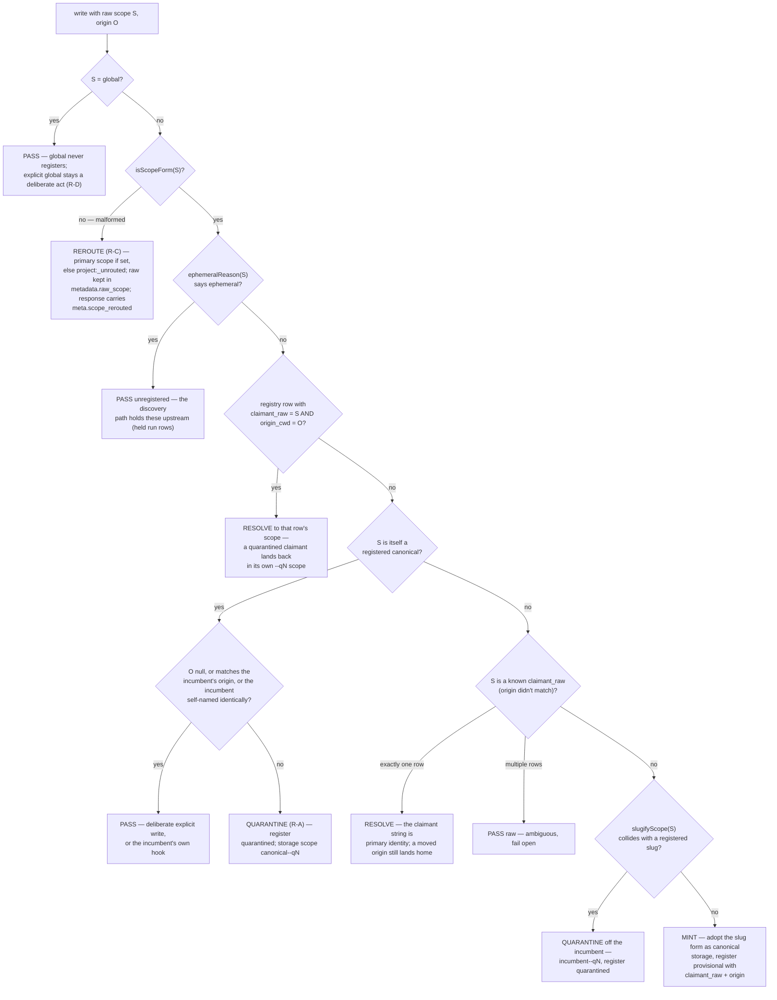

# Scope Minting — the Decision Flow (Phase 3)

How a write's scope string becomes a storage scope. The whole decision is one pure function —
`decideMint(raw, origin, ctx)` in `src/scopes/minting.ts` — run inside the existing T46
`canonicalizeScope` choke point (the five `routes.ts` write sites, the discovery engine, and
re-drive), *after* the alias table has had first crack at the string — on every path, including
the discovery scheduler's per-cycle resolution (final-review C1: registry-only resolution would
quarantine tabled variants instead of pooling them and mint slug rows on ruled-away scopes). No
I/O, no clock: the caller owns the registry read and the register write.

`origin` is the claiming directory (`cwd`) when the path carries one — the observation/discovery
path does; a direct API write (the normal MCP `store_memory` case) does not, and `origin = null`
reads as a deliberate act throughout.

All scope names below are synthetic examples.

## The executable rule order

This is the order the code runs, which deviates from the spec §5 narrative in one deliberate way:
the claimant+origin exact-pair check runs **before** the registered-canonical check, so a
quarantined claimant whose raw string is byte-identical to the incumbent's canonical re-resolves to
its own quarantine scope instead of silently merging with the incumbent. Pinned by
`tests/unit/scope-minting-decision.test.ts`.

Notes that don't fit in boxes:

- **Slug-adoption applies to both prefixes**: a new `client:Acme-Foods` stores under
  `client:acme-foods` with the raw recorded as claimant — the same mechanical fold the alias
  proposer auto-proposes, applied at the source instead of after the drift.
- **Slugify proposes; it never merges.** The slug fold is many-to-one, so it detects collisions and
  names new things; it never resolves one *existing* scope to another. Existing-scope equivalence
  is the alias table's job, via ruling.
- **Reserved rows collide like any other**: a real directory named `unrouted` quarantines rather
  than claiming `project:_unrouted`'s slug.
- The registry never auto-flips a status. Rulings (`POST /api/admin/scopes/rule` —
  `confirm` / `merge_into` / `rename`) are operator actions, and every ruling confirms the ruled
  row (`tests/unit/scope-ruling.test.ts`). The confirming status write runs inside the ruling's
  serialized chain (final-review M1): if it fails after the alias entry landed, the 500 names the
  partial state and the `confirm` retry that heals it.
- **A rename tombstones the scope it frees** (final-review I1): a reserved + confirmed registry
  row stays behind under the freed scope, carrying the ORIGINAL claim slug, so the slug count
  never hands the freed `--qN` suffix to the NEXT colliding claimant — whose rows would match the
  freed scope's alias entry and sweep into the renamed claimant's project (the R-A cross-claimant
  merge). Pinned: after renaming a `--q2` row, a fresh third claimant gets `--q3`.

## Worked example — the done-when walkthrough

The scenario `tests/integration/scope-minting.test.ts` proves end-to-end (4/4), written out:

**Install one.** A session in `C:\dev\My Project` writes with raw scope `project:My Project`.
Rules 1–3 pass it along (not global, well-formed, not ephemeral); rules 4–6 find nothing — the
registry has never seen this claimant or slug. Rule 7: `slugifyScope` gives `project:my-project`,
no collision → **mint**. Storage scope is the slug form; the registry rows
`{scope: project:my-project, claimant_raw: "project:My Project", origin_cwd: C:\dev\My Project,
status: provisional}`. Every later write from that session resolves straight home via rule 4
(claimant+origin) or lands as rule 5's pass — one canonical scope, no variants.

**Install two.** A different checkout at `C:\other\my-project` writes raw `project:my-project` —
byte-identical to the incumbent's canonical. Rule 4: this (claimant, origin) pair is unknown. Rule
5: the raw IS a registered canonical, but the origin differs and the incumbent's claimant was
`project:My Project`, not this string → **quarantine** (R-A). Storage scope
`project:my-project--q2` (the incumbent counts 1); the registry rows a `quarantined` entry with the
new claimant+origin. The incumbent's rows are untouched, the quarantined writes land and stay
separate — never blocked, never merged — and `GET /api/ops/scope-registry` reports the quarantine.
From here on, install two's writes hit rule 4 and re-resolve to `--q2` even though their raw equals
the incumbent's canonical.

**Ruling, both ways.** The operator later rules the quarantine via
`POST /api/admin/scopes/rule`:

- `merge_into` (same project after all): records the ruling, appends
  `{"project:my-project--q2": "project:my-project"}` to the alias table through the shared
  resolver's validation, confirms the row, and names the follow-ups (audited migration driver +
  re-drive) in the response rather than running them behind the operator's back.
- `rename` (genuinely distinct): re-keys the quarantine row to an operator-chosen scope
  (e.g. `project:my-project-fork`), confirms it, appends the alias entry so future writes from
  that claimant land on the new name, and tombstones the freed `--q2` scope so the suffix is never
  re-minted (final-review I1, above).

## Where the rest of Phase 3 hangs off this

- **Held observations, watermarks, re-drive** — HELD scopes never mint. Held is ONE shared
  predicate (`buildHoldPredicate`, `src/discovery/hold.ts`): ephemeral-shaped (rule 3's
  `ephemeralReason`) AND not alias-mapped — an alias entry IS the ruling, so a ruled ephemeral
  scope's observations resolve to the target on the next pass and its rows leave the purge
  exemption (round-2 CO5+S1a). For unruled ephemerals the
  discovery engine writes `held` run rows, the global watermark advances over `held` while
  the per-scope watermark does not (`GLOBAL_WATERMARK_STATUSES` vs `SCOPE_WATERMARK_STATUSES`,
  `src/database/interfaces.ts`), and `POST /api/admin/discovery/redrive` runs a ruled scope's held
  history through the standard pipeline with original timestamps intact. A re-drive is bounded by
  the GLOBAL watermark captured at its start (final-review I2): it only re-covers ids the live
  path already consumed, so its run rows can never advance the global cursor past other scopes'
  unprocessed observations — newer held observations wait for their next held row + a later
  re-drive.
- **Primary scope + triage** — scopeless writes land on `PRIMARY_SCOPE` /
  `operator_config.primary_scope` when set, else `project:_unrouted` — never `global`
  (`tests/unit/scope-write-routing.test.ts`). The primary is alias-canonicalized where it is
  LOADED (`ScopeRegistryService.resolvePrimary`, round-2 CO1), so the scopeless default and the
  malformed-scope reroute land on the same canonical value.
- **Interactive explainer** — `docs/resources/minting-flow.html` (a self-contained static page,
  dev repo only) walks the same flow scene by scene.
